# Computer Pointer Controller
Project is to control the mouse pointer of your computer using gaze estimation model. 
You will be using the InferenceEngine API from Intel's OpenVino ToolKit to build the project. The gaze estimation model requires three inputs:
* The head pose
* The left eye image
* The right eye image.

To get these inputs, you will have to use three other OpenVino models:
* [Face Detection](https://docs.openvinotoolkit.org/latest/_models_intel_face_detection_adas_binary_0001_description_face_detection_adas_binary_0001.html)
* [Head Pose Estimation](https://docs.openvinotoolkit.org/latest/_models_intel_head_pose_estimation_adas_0001_description_head_pose_estimation_adas_0001.html)
* [Facial Landmarks Detection](https://docs.openvinotoolkit.org/latest/_models_intel_landmarks_regression_retail_0009_description_landmarks_regression_retail_0009.html)

## The Pipeline

You will have to coordinate the flow of data from the input, and then amongst the different models and finally to the mouse controller. The flow of data will look like this:


## Project Set Up and Installation
* Follow the guidelines to install the [openVino](https://docs.openvinotoolkit.org/latest/index.html)
* Clone this repo and just follow the [how-to-run](how-to-run.md)

## Running applicaitno (Demo)
* Check [how-to-run](how-to-run.md)


## Documentation
1. Install `Conda` on your system: https://docs.conda.io/projects/conda/en/latest/user-guide/install/macos.html
2. Create virtual environment with python=3.7  `onda create --name py3-udacity python=3.7`
3. Download and install Intel openVino as per your system : https://software.intel.com/en-us/openvino-toolkit/choose-download
4. Verify openVino installation following the steps from openVino documentation.
5. Activate conda environment: `conda activate py3-udacity`
6. Install required binaries using `pip install -r requirements.txt`
7. install numpy `conda install numpy`
8. Install `pyautogui` using command `conda install -c conda-forge pyautogui`
9. Below is the output of `pip freeze` command. Check if I have missed something:
  ```
  certifi==2020.4.5.1
  mkl-fft==1.0.15
  mkl-random==1.1.0
  mkl-service==2.3.0
  numpy==1.18.1
  olefile==0.46
  Pillow==5.3.0
  PyAutoGUI==0.9.48
  PyMsgBox==1.0.7
  pyobjc-core==6.2
  pyobjc-framework-Cocoa==6.1
  pyobjc-framework-Quartz==5.3
  PyScreeze==0.1.26
  PyTweening==1.0.3
  six==1.14.0
  ```
 
* Run command `python3 main.py -h` to get the supported arguments
* Inference Engine API Docs [here](https://docs.openvinotoolkit.org/latest/_inference_engine_ie_bridges_python_docs_api_overview.html)
* Model documentation [here](https://docs.openvinotoolkit.org/latest/_models_intel_index.html) 

## Project Directory structure
- **bin**
  * this folder contains a demo video (demo.mp4)
- **images**
  * This folder has graph/plot of the results of this application. It also has other images like pipeline diagram which are used in readme file.
- **models**
  * Ideally this directory should have all the downloaded model, but you can choose some other directory as well to store the models.
- **src**
  * This is the main project directory which has all the required code to run this applicaiton.
  * **face-detection.py, facial_landmark_detection.py, head_pose_estimation.py and gaze_estimation.py** -- All these python files have the inference code for each model that we are using. These files have the complete code to run a model including pre_processing of inputs and outputs.
  * **main.py** This is the main file which runs the whole application adn uses the above described files to calculate the mouse pointer and move it.
  * **mouse_controller.py** -- This is a utility kind of file whihc is used to move mouse cursor location.
  * **computer-controller.ipynb** -- This python notebook has the steps and code to run the model on intel-dev cloud and using this you can deploy this application on various devices like CPU, VPU, FPGA etc.
  * **queue-job.sh** -- This file is just a shell scripts that will be used to submit the job qsub while running the application on intel-edge devices.
  * **There are few other file which not of much use and are created for testing only.**

## Benchmarks
I run this model on 4 different hardware using Intel-dev cloud. Below is the list of hardware used and their results.

CPU: https://ark.intel.com/products/88186/Intel-Core-i5-6500TE-Processor-6M-Cache-up-to-3-30-GHz-

IGPU: https://ark.intel.com/products/88186/Intel-Core-i5-6500TE-Processor-6M-Cache-up-to-3-30-GHz-

VPU: https://software.intel.com/en-us/neural-compute-stick

FPGA: https://www.ieiworld.com/mustang-f100/en/


**Results with Model Precision-FP32:**

FPS Graph                  |  Model load time plot
:-------------------------:|:-------------------------:
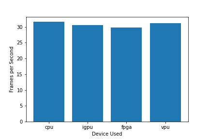  |  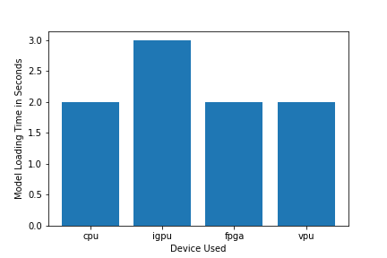

Inference time plot        |  Combine graph for all 
:-------------------------:|:-------------------------:
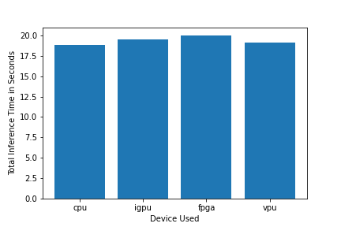  |  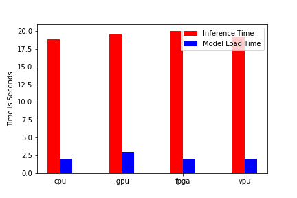  
</br>

**Results with Model Precision-FP16:**

FPS Graph                  |  Model load time plot
:-------------------------:|:-------------------------:
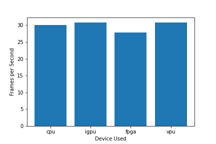  |  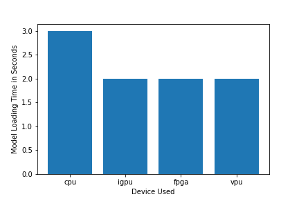

Inference time plot        |  Combine graph for all 
:-------------------------:|:-------------------------:
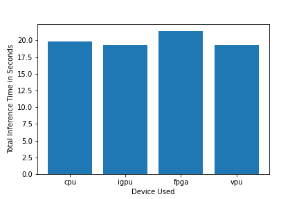  |  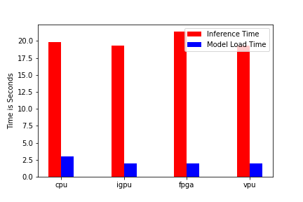

</br>

**Results with Model Precision-FP32-INT8:**

FPS Graph                  |  Model load time plot
:-------------------------:|:-------------------------:
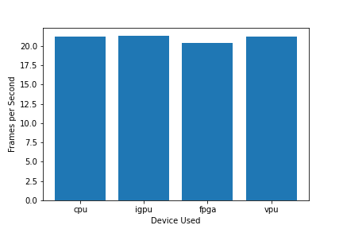  |  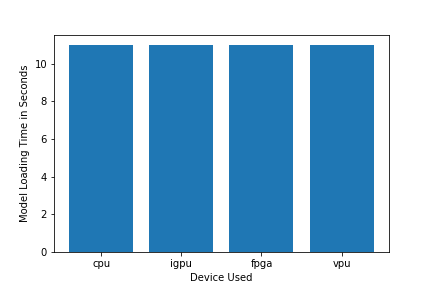

Inference time plot        |  Combine graph for all 
:-------------------------:|:-------------------------:
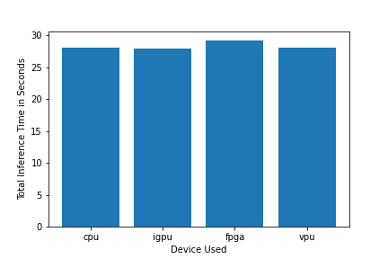  |  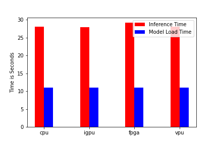  


NOTE: I have attached the expected working python notebook to run this experiment on multiple devices. Check it [here](src/computer-controller.ipynb)

## Results
As clear from the above results, total inference time and model load time is almost equal for all the device. While running application with model precision = FP32, it took a slight more time as it would require more compution. And I don't see any larger decrease in the accuracy while running the applicaition with low precision models. This may be because of the simplicity of models used and the ability to run smoothely on lower precision without affecting much of accuracy.

To run this model on intel-dev-cloud platform, use this [notebook](src/computer-controller.ipynb) and follow the guidlines from [how-to-run](how-to-run.md)

## Stand Out Suggestions
This is where you can provide information about the stand out suggestions that you have attempted.

### Async Inference
If you have used Async Inference in your code, benchmark the results and explain its effects on power and performance of your project.

### Edge Cases
There will be certain situations that will break your inference flow. For instance, lighting changes or multiple people in the frame. Explain some of the edge cases you encountered in your project and how you solved them to make your project more robust.
